# Hospital Care Portal

A secure, full-stack, role-based medical portal built on **ASP.NET Core MVC (Model-View-Controller)** and **Microsoft SQL Server**. This system automates clinical administration workflows, separating access permissions for Patients, Doctors, and Administrators.

---

## 🌟 Key Features

### 👤 Role-Based Authorization
- **Patients**: Browse verified doctor specialties, request appointment slots, inspect notifications, and view consultation history.
- **Doctors**: Manage weekly availability shifts (templates), inspect upcoming patient booking queues, and write clinical diagnoses or prescriptions.
- **Administrators**: Approve/reject pending doctor signup applications, audit portal statistics, manage user credentials, and delete profiles.

### 📅 Advanced Scheduling Engine
- **Past Date Protection**: Blocks booking appointments on dates that have already passed in the user's local timezone.
- **Availability Window Checks**: Cross-references booking times with the doctor's active weekly shift schedule.
- **Double-Booking Slot Protection**: Implements a conflict resolution algorithm that checks for overlapping approved bookings within a 30-minute window of the requested slot.

### ⏱️ Dynamic Timezone Synchronization
- Resolves server timezone mismatch (e.g. US cloud servers vs local users) by writing browser offsets to a local cookie via JavaScript and offsetting UTC times dynamically in C# helper services.

### 🔒 Security & Data Integrity
- **Password Encryption**: Salts and hashes plain-text credentials using **BCrypt** before saving to the database.
- **Cross-Site Scripting (XSS) & CSRF Protection**: Enforces `[ValidateAntiForgeryToken]` and HTML sanitization across forms.
- **Cascading Deletes**: Configured via Entity Framework Fluent API to automatically purge profile extensions and files when a user account is deleted.
## 📸 Screenshots

### Landing Page
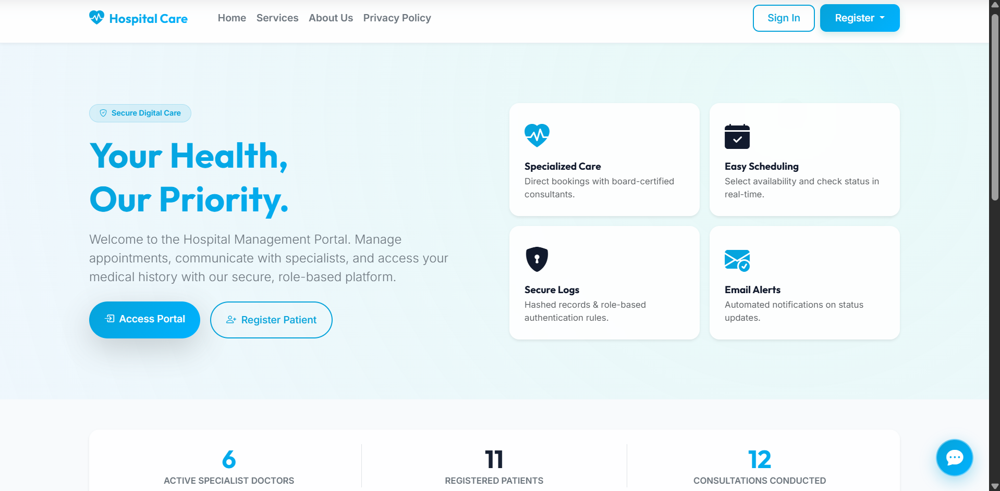

### Admin Control Panel
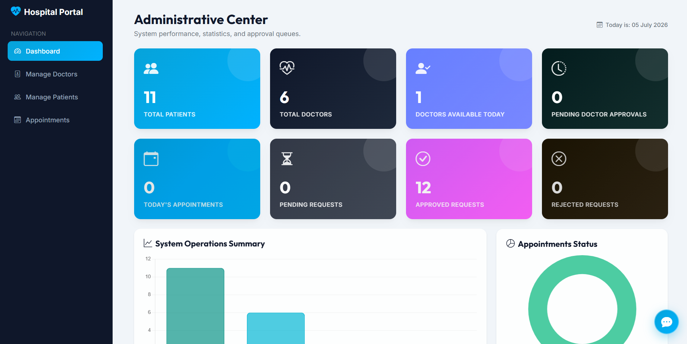

### Patient Appointment Scheduler
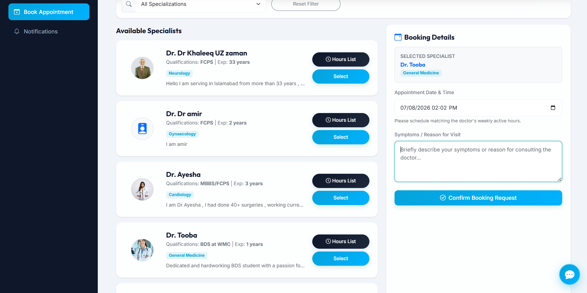

### Doctor Consultation Queue
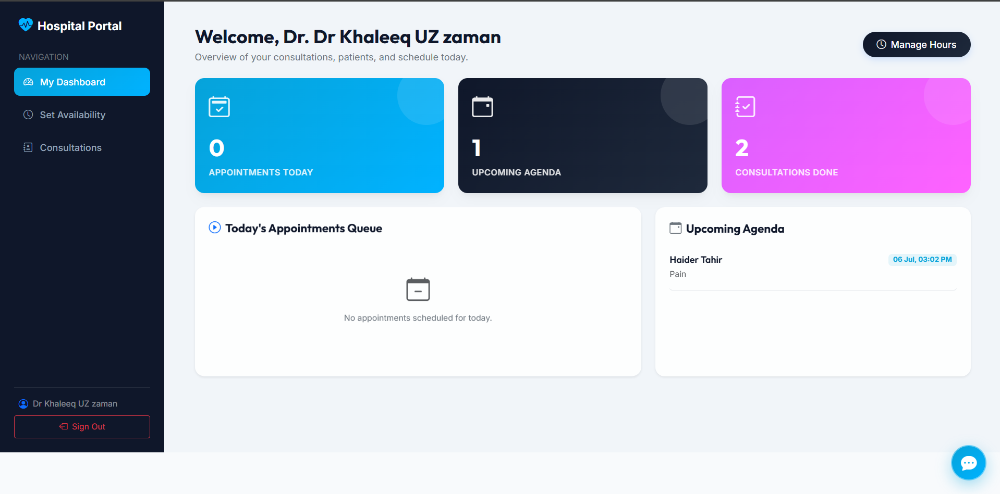

## 🎥 Live Demo Video
To watch the portal workflows in action (User registrations, Admin approvals, Booking conflicts, and Doctor consultation logs), watch our walkthrough:
👉 **[Watch the Live Demo Video on YouTube](https://youtu.be/pH0B2tCFV3c)**

---


## 📊 System Architecture & Diagrams

### 1. System Overview
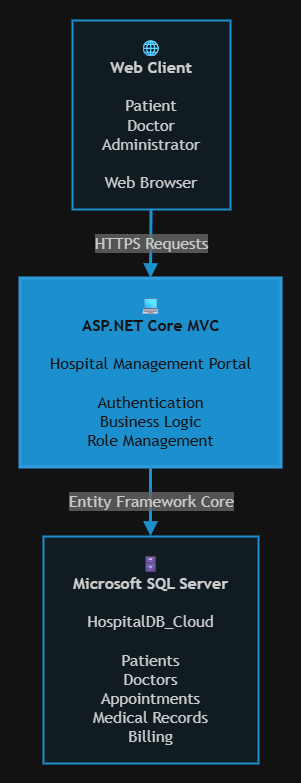

### 2. Simple Architectural View
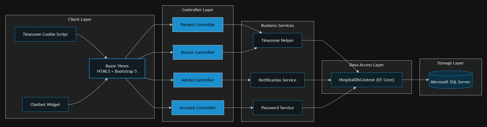

### 3. Detailed Architectural View
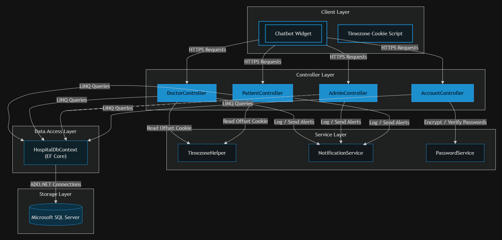

### 4. Process Flow Diagram
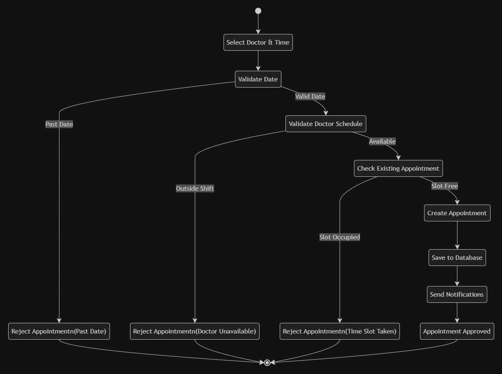

### 5. Use Case Diagram
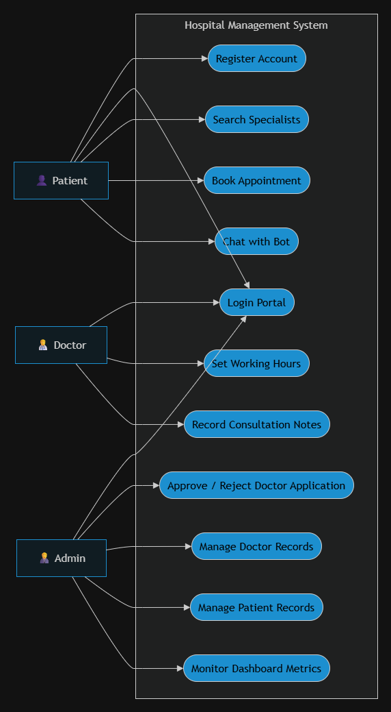

### 6. Class Diagram
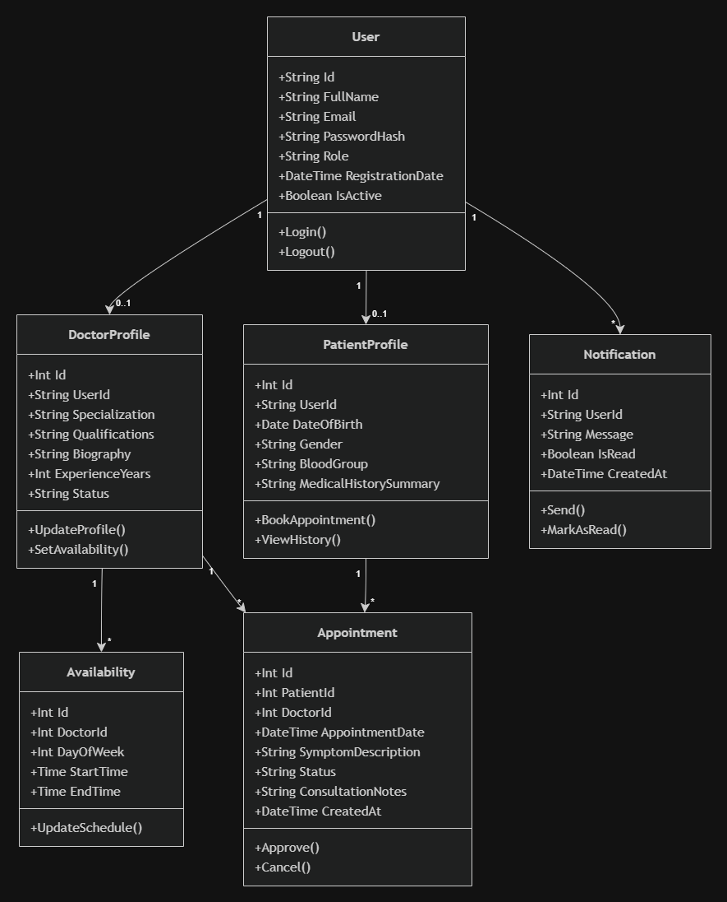

### 7. Sequence Diagram
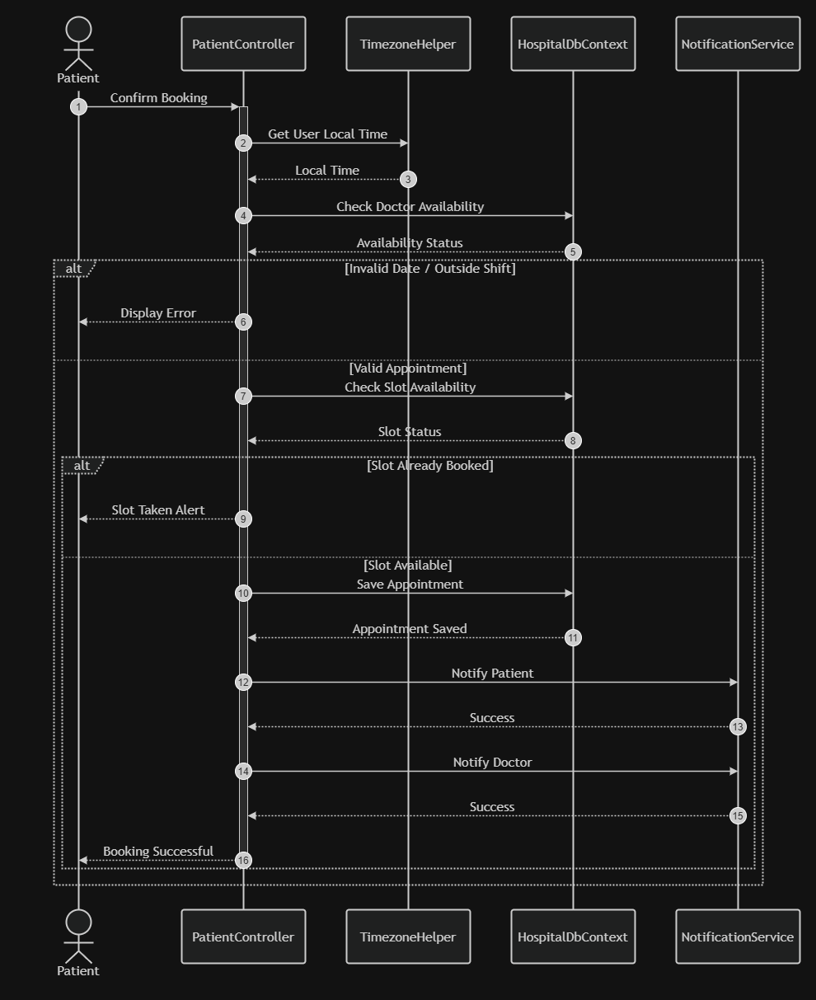

### 8. State Transition Diagram
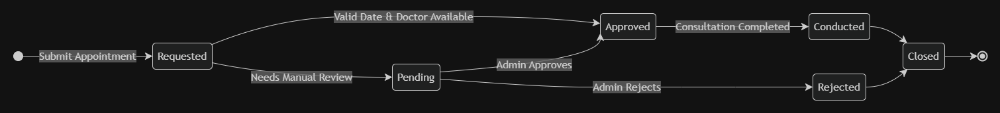

---

## 💻 Tech Stack
- **Backend Framework**: .NET 10.0 (ASP.NET Core MVC)
- **Object-Relational Mapper (ORM)**: Entity Framework Core (EF Core)
- **Database**: Microsoft SQL Server
- **Security Library**: BCrypt.Net-Next
- **Frontend**: HTML5, Vanilla CSS (with custom Glassmorphic design), Bootstrap 5, jQuery
- **Version Control**: Git & GitHub

---

## 🚀 Setup & Installation

### Prerequisites
- [.NET SDK 10.0](https://dotnet.microsoft.com/download)
- [Microsoft SQL Server LocalDB](https://learn.microsoft.com/sql/database-engine/configure-windows/sql-server-express-localdb) or Express Edition
- [SQL Server Management Studio (SSMS)](https://learn.microsoft.com/sql/ssms/download-sql-server-management-studio-ssms)

### Steps
1. **Clone the Repository**:
   ```bash
   git clone https://github.com/your-username/hospital-care-portal.git
   cd hospital-care-portal
   ```
2. **Configure Database**:
   - Open SSMS and execute the setup script located in the project root: [database_setup.sql](database_setup.sql).
   - Verify connection strings in [appsettings.json](appsettings.json) match your SQL local server credentials.
3. **Build & Run**:
   ```bash
   dotnet build
   dotnet run
   ```
4. **Access the Portal**:
   - Open your browser and navigate to `http://localhost:5000` (or the port specified in terminal).
   - Log in using the default administrator credentials seeded in your database (configured in `Program.cs`).
